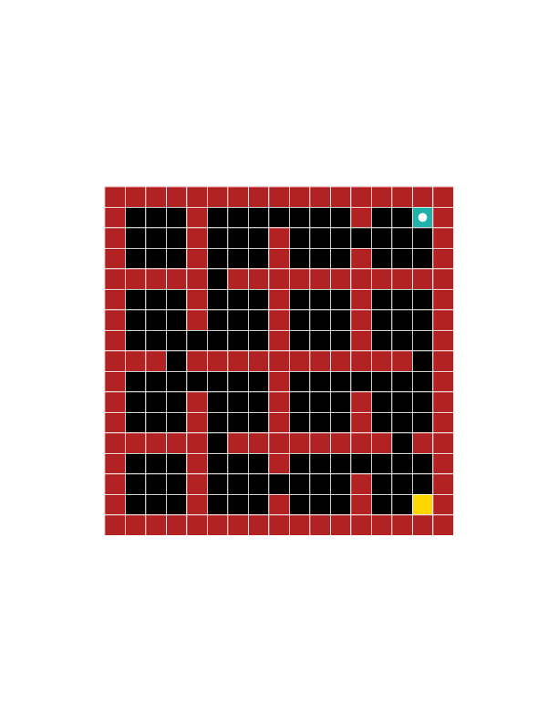

# Hierarchical Imitation - Reinforcement Learning
Code for our paper ["Hierarchical Imitation and Reinforcement Learning"](https://arxiv.org/abs/1803.00590)

Here you can find the implementation of Hierarchical DAgger, Hierarchical Behavior Cloning for the Maze Domain and Hybrid Imitation-Reinforcement Learning algorithms for the Atari game Montezuma's Revenge

Requires Tensorflow and Keras (the experiments were run on Tensorflow version 1.3.0 and Keras version 2.1.2. Note that I used Cuda version 8.0.61 and cuDNN 6.0.21)

----
#### Sample result of Hierarchical DAgger on Maze Navigation ####

Example runs on several instances of maze domain. Here both the meta-controller and low-level controllers are learned with imitation learning.

----
#### Sample result of Hybrid Imitation - Reinforcement Learning on Montezuma's Revenge first room ####

Here the meta-controller is trained with DAgger, and low-level controllers are learned with DDQN (Double Q Learning with prioritized experience replay)

