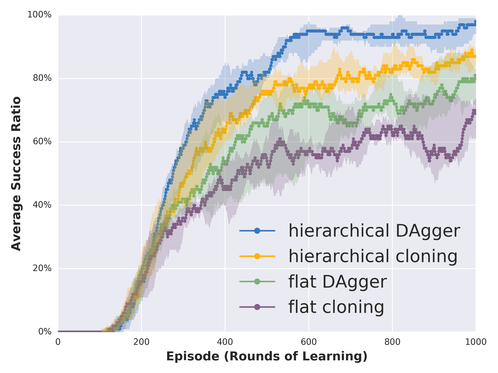
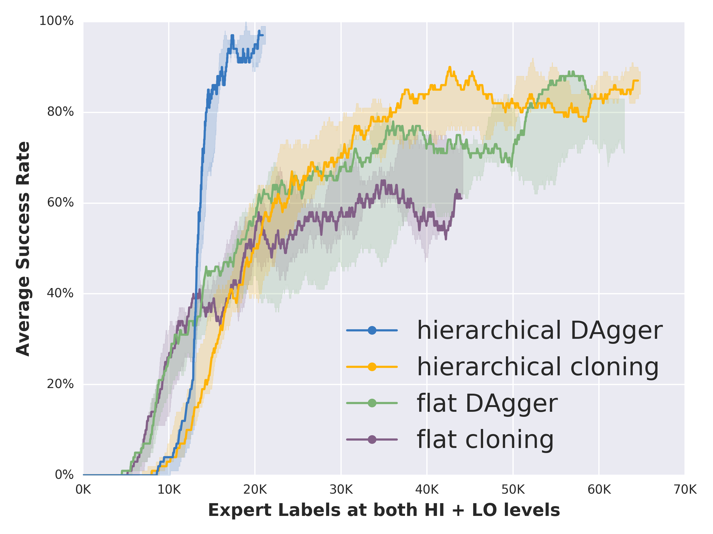

# Hierarchical Imitation - Reinforcement Learning
Code for our paper ["Hierarchical Imitation and Reinforcement Learning"](https://arxiv.org/abs/1803.00590)

Here you can find the implementation of Hierarchical DAgger, Hierarchical Behavior Cloning for the Maze Domain and Hybrid Imitation-Reinforcement Learning algorithms for the Atari game Montezuma's Revenge

Requires Tensorflow and Keras (the experiments were run on Tensorflow version 1.3.0 and Keras version 2.1.2. Note that I used Cuda version 8.0.61 and cuDNN 6.0.21)

----
#### Example Result of Hierarchical DAgger on Maze Navigation ####

We have multiple random instances of the environment, with 4x4 room structure. The agent (white dot) is supposed to navigate to the destination in the yellow block,  while avoiding all the obstacles (red). Primitive actions are taking one step Up, Down, Left or Right. High level actions are navigating to the Room to the North, South, West, East or Stay (if the target block is in the same room). 

Here both the meta-controller and low-level controllers are learned with imitation learning. 

----
#### Example Result of Hybrid Imitation - Reinforcement Learning on Montezuma's Revenge first room ####

Panama Joe the adventurer needs to pick up the key, reverse his own path and go to open one of the two doors. 

For this instantiation of hybrid Imitation-Reinforcement learning, the meta-controller is trained with DAgger, and low-level controllers are learned with DDQN (Double Q Learning with prioritized experience replay). 

----
#### Hierarchical Imitation Learning vs. Flat Imitation Learning Comparison ####

 

----
#### Hybrid Imitation-Reinforcement Learning vs. Hierarchical RL Comparison ####

